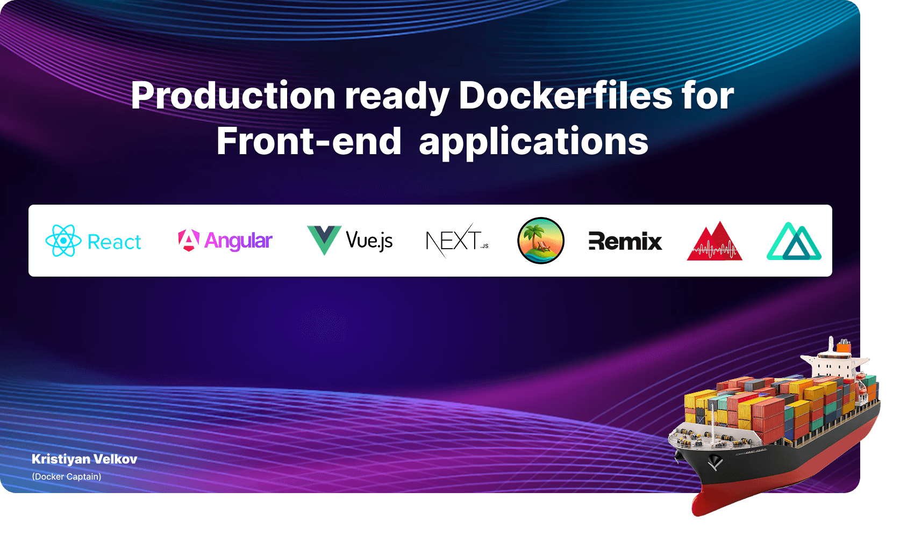

Production-ready Dockerfiles for **React.js**, **Angular**, **Vue.js**, **Next.js**, **Remix**, **TanStack Start**, **Analog**, and **Nuxt** — built with security, performance, and proven Docker best practices.

Ready-to-use, production-grade setups for modern front-end apps. Use them as-is, adapt when needed, and deploy with confidence — each follows established Docker standards and best practices. 

**Author**: [Kristiyan Velkov](https://www.linkedin.com/in/kristiyan-velkov-763130b3/) — person behind official Docker guides for [React.js](https://docs.docker.com/guides/reactjs/), [Angular](https://docs.docker.com/guides/angular/), [Vue.js](https://docs.docker.com/guides/vuejs/), [Node.js](https://docs.docker.com/guides/nodejs/), and more.

</div>

--- 

### Features

- **Optimized for Production** – Ensures smaller, faster, and more secure images.
- **Security Best Practices** – Uses non-root users and follows Docker security guidelines.
- **Multi-Stage Builds** – Reduces final image size by separating build and runtime environments.
- **Efficient Caching** – Utilizes layer caching to speed up builds.
- **Minimal Base Images** – Uses lightweight images like `alpine` to reduce attack surface.

### Supported Frameworks / Libraries

| Framework             | Version            | Directory         | Port |
| --------------------- | ------------------ | ---------------- | ---- |
| ✅ **React.js**       | v19.2.3            | `react.js/`       | 8080 |
| ✅ **Next.js**        | v16.1.1            | `next.js/`        | 3000 |
| ✅ **Remix.js**       | React Router v7.10 | `remix.js/`       | 3000 |
| ✅ **TanStack Start** | v1.132             | `tanstack-start/` | 3000 |
| ✅ **Angular**        | v21                | `angular/`        | 8080 |
| ✅ **Analog.js**      | v2.2 (Angular 21)  | `analog.js/`      | 3000 |
| ✅ **Vue.js**         | v3.5               | `vue.js/`         | 8080 |
| ✅ **Nuxt.js**        | v4.2               | `nuxt.js/`        | 3000 |

---

## Getting Started

Clone the repository and navigate to the desired framework directory:

```sh
git clone https://github.com/kristiyan-velkov/frontend-dockerfiles.git
cd frontend-dockerfiles/<framework>
```

---

## Docker Compose

Each project includes a `compose.yml` file. To build and run with Docker Compose, navigate to the framework folder, then:

```sh
docker compose up --build
```

To run in the background (detached):

```sh
docker compose up --build -d
```

To stop and remove containers:

```sh
docker compose down
```

---

## Task or Make

To use the commands in the table below, you need [Docker Desktop](https://www.docker.com/products/docker-desktop/) and either:

- [Task](https://taskfile.dev/installation/) — for Taskfile commands.

_or if you prefer Make_:

- [Make](https://en.wikipedia.org/wiki/Make_(software)) — for Makefile commands.


### Usage

| Taskfile Command       | Makefile Command       | Description                          |
| ---------------------- | ---------------------- | ------------------------------------ |
| `task`                 | `make`                 | Show available commands.             |
| `task build`           | `make build`           | Build the Docker image.              |
| `task run`             | `make run`             | Run the Docker container.            |
| `task build-run`       | `make build-run`       | Build and run the Docker container.  |
| `task stop`            | `make stop`            | Stop the Docker container.           |
| `task restart`         | `make restart`         | Restart the Docker container.        |
| `task logs`            | `make logs`            | Show logs from the Docker container. |
| `task clean`           | `make clean`           | Remove Docker image and container.   |
| `task clean-container` | `make clean-container` | Remove only the Docker container.    |
| `task clean-image`     | `make clean-image`     | Remove only the Docker image.        |

---

### Environment Variables

The following variables are defined in the `Taskfile` and `Makefile` and can be customized if needed:

| Variable         | Description                                                                          |
| ---------------- | ------------------------------------------------------------------------------------ |
| `IMAGE_NAME`     | The name of the Docker image.                                                        |
| `CONTAINER_NAME` | The name of the Docker container.                                                    |
| `HOST_PORT`      | The port on the host machine that the container will map to.                         |
| `CONTAINER_PORT` | The port inside the Docker container where the application is served.                |
| `DOCKERFILE`     | The Dockerfile to use.                                                               |
| `NODE_VERSION`   | The version of Node.js used in the base image. Can be updated for easier migrations. |
| `NGINX_VERSION`  | The version of Nginx used for static file serving (SPA applications).                |

---

## 📌 Contribution

Contributions are always welcome, whether it's reporting issues, improving documentation, fixing bugs, or adding new features. This project is for everyone! 💙

---

## 🕵️‍♂️ Why this repository exists

As a front-end developer, author of the official Docker front-end guides, book author, and technical speaker, I’ve repeatedly seen the same problems across teams and projects: over-engineered Dockerfiles, inefficient caching, insecure images running as root, bloated production builds, and documentation copied without understanding the trade-offs.

This repository exists to address those issues by providing **clear, production-ready Dockerfiles** that reflect how front-end applications are actually built, shipped, and maintained in real environments.

**The goal:** bridge the gap between front-end developers and DevOps by offering practical, trustworthy Docker setups that can be used directly, understood easily, and adapted with confiden.

---

## ☕ Support My Work

If you find this useful, consider giving the repo a **⭐️ star** — it helps others discover it.

If you'd like to support me further, you can donate via:

- [Revolut](https://revolut.me/kristiyanvelkov)
- [Buy Me a Coffee](https://www.buymeacoffee.com/kristiyanvelkov)
- [GitHub Sponsors](https://github.com/sponsors/kristiyan-velkov)

Your support helps me continue creating valuable content for the community. Thank you!

---

## 📬 Contact me

If you'd like to connect, feel free to reach out via:

- [LinkedIn](https://www.linkedin.com/in/kristiyan-velkov-763130b3/)
- [X.com](https://x.com/krisvelkov)
